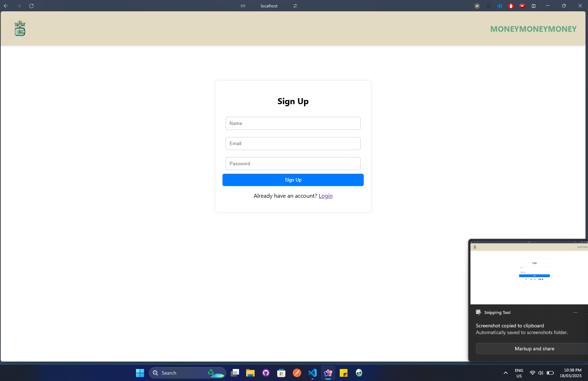
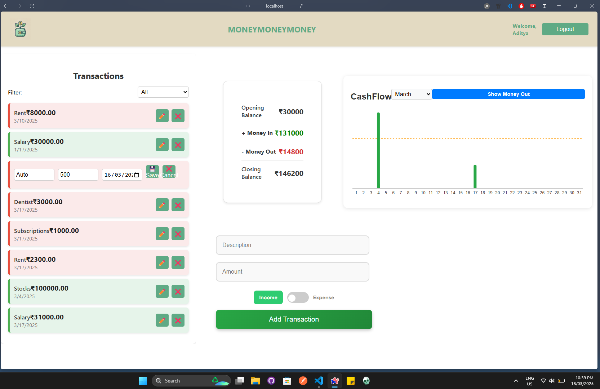
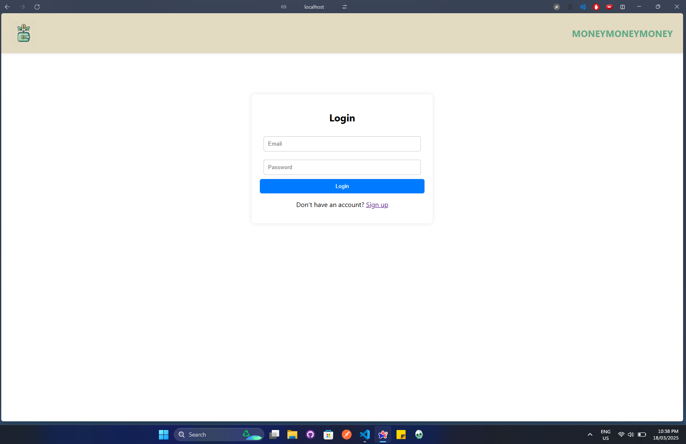

# Budgeting App

## Overview

The **Budgeting App** is a simple and intuitive financial tracking tool that allows users to manage their income and expenses efficiently. The app provides a **graphical representation** of financial data and a **dashboard** to offer an overall summary of user transactions.

## Features

- **User Authentication** – Login and Signup system for secure access
- **Transaction Management** – Add, update, and delete income/expense entries
- **Dashboard** – View an overall financial summary in one place
- **Graphical Reports** – Visual representation of financial data for easy analysis
- **Responsive UI** – Designed to work seamlessly on different screen sizes

## Tech Stack

### Frontend:

- React (Vite) for fast development
- React Router for navigation
- Recharts for graphical visualization
- CSS for styling

### Backend:

- Express.js for handling API requests
- MongoDB for data storage
- Mongoose for database interaction
- Express-session for session-based authentication

## Project Structure

```
/backend
  ├── models/         # Mongoose models
  ├── routes/         # Express API routes
  ├── auth/           # Authentication logic
  ├── server.js       # Main backend server

/frontend
  ├── src/
      ├── components/ # React UI components
      ├── App.js      # Root React component
      ├── index.js    # Entry point
```

## Installation & Setup

### 1. Clone the Repository

```bash
git clone https://github.com/your-username/budgeting-app.git
cd budgeting-app
```

### 2. Install Dependencies

#### Backend

```bash
cd backend
npm install
```

#### Frontend

```bash
cd frontend
npm install
```

### 3. Configure Environment Variables

Create a `.env` file in the `backend/` directory and add:

```
MONGO_URI=your-mongodb-connection-string
SESSION_SECRET=your-secret-key
```

### 4. Run the Application

#### Start Backend Server

```bash
cd backend
node server.js
```

#### Start Frontend

```bash
cd frontend
npm run start
```

## Future Enhancements

- **JWT-based authentication** for enhanced security
- **Recurring transactions** feature
- **Data export/import** functionality
- **AI-powered budgeting insights**

   
